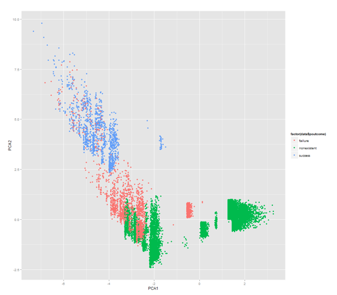
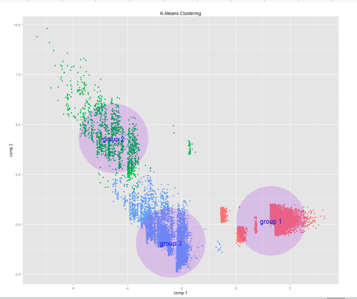
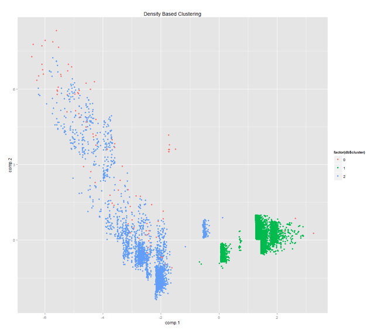
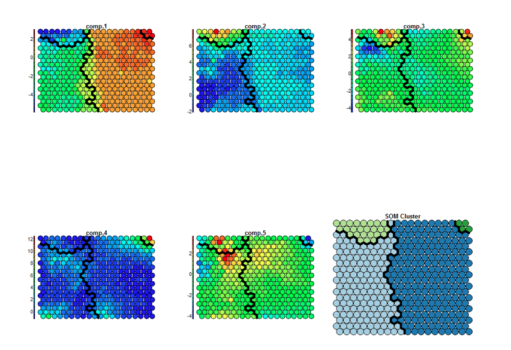

#Project Goals
The goal of the project was to use a dataset of about 40,000 bank customers information
and cluster the customers into marketing segments. This was an unspervised approach,
PCA was used to reduce dimensionality and to investigate the PCA loadings
to establish customer archetypes, then those PCA dimensions were used to
perform k-means clustering, density based clustering, and self organizing map clustering.

The full explanation is in the PDF document.

##Graphs and Model Output

pca dimension 1 and pca dimension 2:

k-means clustering where k=3:

density based clustering:

self organizing map of each PCA dimension with hierarchical clustering:

